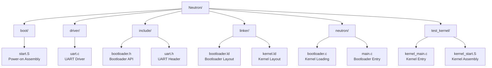
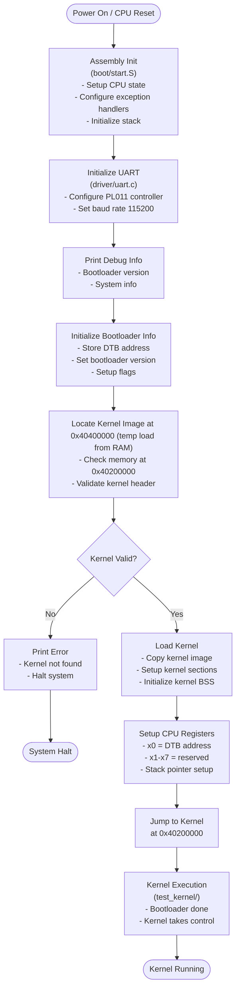
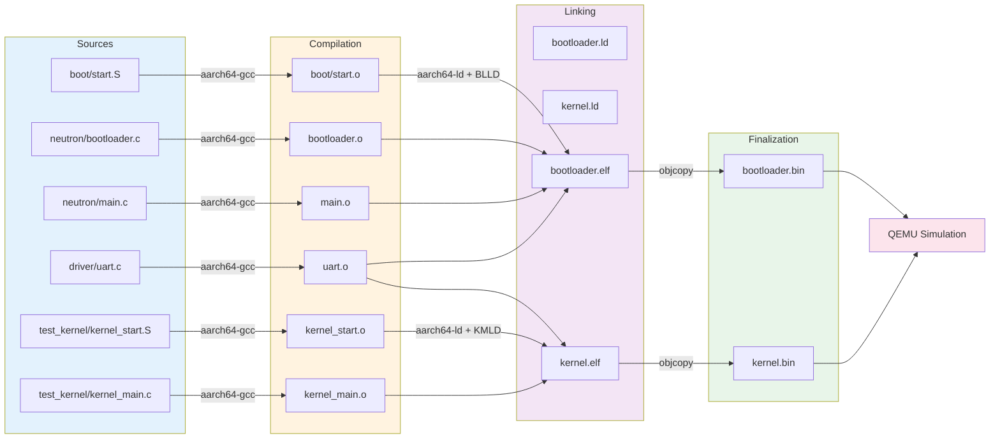

# Neutron Bootloader - Project Architecture

**Project**: Neutron Bootloader - Project Atom  
**Organization**: serene brew  
**Author**: mintRaven-05  
**License**: BSD-3-Clause  
**Target**: ARMv8 AArch64 bare-metal bootloader + test kernel for QEMU  
**Platform**: QEMU `-machine virt`

---

## Project Directory Structure



---

## Directory Overview

### **root/** — Project Root
- **Contains**: Build configuration and project metadata
- **Key Files**:
  - `Makefile` - Build system configuration for cross-compilation
  - `LICENSE` - BSD-3-Clause licensing information
- **Purpose**: Entry point for building both bootloader and test kernel

---

### **boot/** — Bootloader Assembly
- **Contains**: Power-on initialization code in assembly
- **Key Files**:
  - `start.S` - ARM assembly entry point executed immediately after CPU reset
- **Purpose**: 
  - CPU initialization and bare-metal setup
  - Sets up exception handlers
  - Jumps to bootloader main code (C code in `neutron/`)
- **Architecture**: ARMv8 AArch64

---

### **driver/** — Hardware Drivers
- **Contains**: Device driver implementations
- **Key Files**:
  - `uart.c` - PL011 UART driver for serial communication
- **Purpose**:
  - UART driver provides serial output (debug messages)
  - Located at `0x09000000` on QEMU virt machine
  - Supports 115200 baud rate
- **Used by**: Both bootloader and test kernel

---

### **include/** — Header Files
- **Contains**: Public API definitions and interfaces
- **Key Files**:
  - `bootloader.h` - Bootloader data structures and function declarations
  - `uart.h` - UART driver interface
- **Purpose**: Interface contracts between modules
- **Main Structures**:
  - `bootloader_info_t` - Bootloader information (DTB address, version, flags)

---

### **linker/** — Linker Scripts
- **Contains**: Memory layout definitions for both bootloader and kernel
- **Key Files**:
  - `bootloader.ld` - Memory layout for bootloader binary
  - `kernel.ld` - Memory layout for test kernel binary
- **Purpose**:
  - Defines memory sections (text, rodata, data, bss, stack)
  - Sets load addresses for executables
  - Bootloader typically loads at low memory (0x40000000+)
  - Kernel typically loads at (0x40200000+)

---

### **neutron/** — Bootloader Core
- **Contains**: Main bootloader implementation
- **Key Files**:
  - `main.c` - Bootloader entry point and main logic
  - `bootloader.c` - Kernel loading and jumping mechanism
- **Purpose**:
  - UART initialization for debug output
  - Bootloader information initialization with DTB address
  - Kernel image location and loading logic
  - Jump to kernel at 0x40200000 with DTB in x0 register
- **Key Responsibilities**:
  1. Print bootloader version and information
  2. Locate kernel image in storage/memory
  3. Load kernel to memory
  4. Jump to kernel with proper register setup

---

### **test_kernel/** — Test/Sample Kernel
- **Contains**: Minimal kernel for bootloader validation
- **Key Files**:
  - `kernel_main.c` - Kernel entry point (bare-metal minimal implementation)
  - `kernel_start.S` - Kernel assembly entry
  - `ascii.txt` - Test data
- **Purpose**:
  - Validates bootloader's kernel loading mechanism
  - Tests kernel execution in bootloader-provided environment
  - Minimal implementation showing UART communication
- **Functionality**:
  1. Initialize UART
  2. Print greeting message
  3. Infinite loop (proof of execution)

---

## Build Pipeline



---

## Memory Layout

### Bootloader Memory Map
```
0x40000000 +--------------------+
           | Bootloader Code    |  (start.S, main.c, bootloader.c)
           | BSS Segment        |  (uninitialized data)
           +--------------------+
           | Bootloader Stack   |
0x40100000 +--------------------+
           | (unused)           |
0x40200000 +--------------------+
           | Test Kernel Code   |  (kernel_start.S, kernel_main.c)
           | Kernel BSS         |
           | Kernel Stack       |
0x40300000 +--------------------+
           | DTB (Device Tree)  |  (provided by QEMU)
```

---

## Key Components & Responsibilities

| Component | Location | Responsibility |
|-----------|----------|-----------------|
| **CPU Init** | `boot/start.S` | Exception setup, CPU state initialization, memory fence |
| **Bootloader Main** | `neutron/main.c` | UART init, bootloader info, kernel discovery |
| **Kernel Loading** | `neutron/bootloader.c` | Load kernel image, validate, setup x0 (DTB), jump to kernel |
| **UART Driver** | `driver/uart.c` | PL011 initialization, character I/O for debugging |
| **Linker Scripts** | `linker/*.ld` | Memory section layout, symbol definitions, load addresses |
| **Test Kernel** | `test_kernel/kernel_main.c` | Accept control from bootloader, prove execution with output |

---

## Cross-Compilation Toolchain

The project uses AArch64 cross-compiler (auto-detected):
- **Options**: `aarch64-none-elf-*`, `aarch64-linux-gnu-*`, or `aarch64-elf-*`
- **Key Tools**:
  - `aarch64-*-gcc` - C compiler
  - `aarch64-*-as` - Assembler
  - `aarch64-*-ld` - Linker
  - `aarch64-*-objcopy` - Binary generator
  - `aarch64-*-objdump` - Disassembler

---

## References

- **QEMU virt machine**: UART at `0x09000000` (PL011)
- **ARM Documentation**: ARMv8 AArch64 ISA
- **QEMU Parameters**: `-machine virt -cpu cortex-a53 -m 256M`
- **License**: BSD-3-Clause (see LICENSE file)
