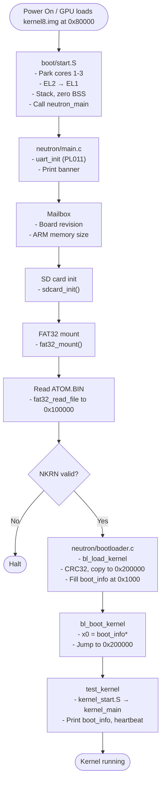
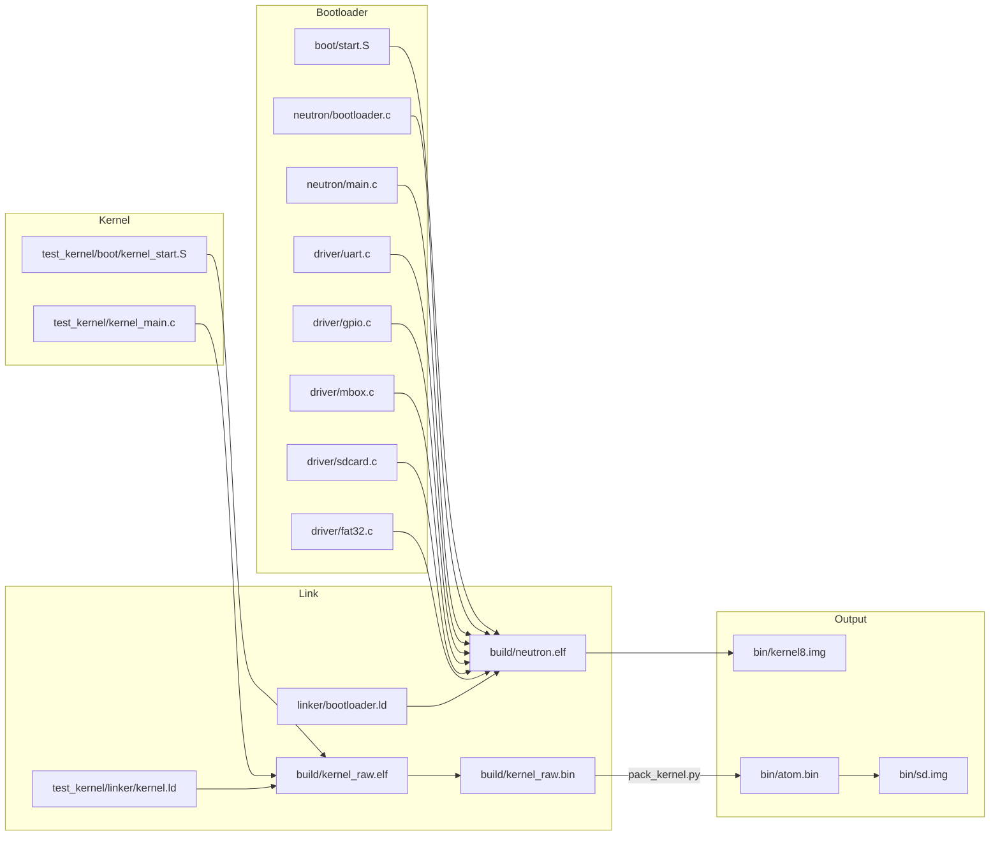

# Neutron Bootloader - Project Architecture

**Project**: Neutron Bootloader - Project Atom  
**Organization**: serene brew  
**Author**: mintRaven-05  
**License**: BSD-3-Clause  
**Target**: ARMv8-A AArch64 bare-metal bootloader + test kernel  
**Platform**: Raspberry Pi Zero 2W / Pi 3B (BCM2710/BCM2837); QEMU `-machine raspi3b`

---

## Project Directory Structure

```mermaid
graph TD
    ROOT["Neutron/"]
    ROOT --> BOOT["boot/"]
    ROOT --> DRIVER["driver/"]
    ROOT --> INCLUDE["include/"]
    ROOT --> LINKER["linker/"]
    ROOT --> NEUTRON_DIR["neutron/"]
    ROOT --> TEST_KERNEL["test_kernel/"]
    ROOT --> SCRIPT["build.ps1 / pack_kernel.py / Dockerfile"]

    BOOT --> BOOT_S["start.S<br/>Power-on Assembly"]

    DRIVER --> UART_C["uart.c"]
    DRIVER --> GPIO_C["gpio.c"]
    DRIVER --> MBOX_C["mbox.c"]
    DRIVER --> SD_C["sdcard.c"]
    DRIVER --> FAT32_C["fat32.c"]

    INCLUDE --> PLATFORM_H["platform.h<br/>Memory map"]
    INCLUDE --> BOOTLOADER_H["bootloader.h<br/>NKRN / boot_info"]
    INCLUDE --> UART_H["uart.h"]
    INCLUDE --> GPIO_H["gpio.h"]
    INCLUDE --> MBOX_H["mbox.h"]
    INCLUDE --> SDCARD_H["sdcard.h"]
    INCLUDE --> FAT32_H["fat32.h"]
    INCLUDE --> AARCH64_H["aarch64.h"]

    LINKER --> BOOTLOADER_LD["bootloader.ld<br/>0x80000"]

    NEUTRON_DIR --> BOOTLOADER_C["bootloader.c<br/>NKRN load / jump"]
    NEUTRON_DIR --> MAIN_C["main.c<br/>Bootloader entry"]

    TEST_KERNEL --> KERNEL_MAIN["kernel_main.c"]
    TEST_KERNEL --> KERNEL_BOOT["boot/kernel_start.S"]
    TEST_KERNEL --> KERNEL_LD["linker/kernel.ld<br/>0x200000"]
```



---

## Directory Overview

### **root/** — Project Root

- **Contains**: Build configuration and project metadata
- **Key Files**:
  - `Makefile` — Build system (bootloader, kernel, SD image, QEMU)
  - `pack_kernel.py` — NKRN kernel image packer (header + CRC32)
  - `build.ps1` — Docker-based build helper for Windows
  - `Dockerfile` — Build environment (Ubuntu 24.04, aarch64 toolchain, mtools)
  - `LICENSE` — BSD-3-Clause

---

### **boot/** — Bootloader Assembly

- **Contains**: Power-on initialization in assembly
- **Key Files**:
  - `start.S` — First code executed after GPU/QEMU loads `kernel8.img` at 0x80000
- **Purpose**:
  - Park secondary cores (only core 0 continues)
  - Detect exception level (EL2 or EL1); if EL2, drop to EL1 (HCR_EL2, SPSR_EL2, ELR_EL2, eret)
  - Disable MMU and caches at EL1
  - Set stack to `_start` (0x80000), zero BSS
  - Call `neutron_main()` (C)
- **Architecture**: ARMv8-A AArch64

---

### **driver/** — Hardware Drivers

- **Contains**: Device driver implementations for BCM2837-style peripherals
- **Key Files**:
  - `uart.c` — PL011 UART0 at 0x3F201000 (GPIO 14/15 ALT0), 115200 8N1, 48 MHz clock
  - `gpio.c` — GPIO function select and pull-up/down (GPPUD/GPPUDCLK sequence)
  - `mbox.c` — VideoCore mailbox (property channel): board revision, ARM memory size
  - `sdcard.c` — SD/MMC card init and block read (EMMC/SDHCI controller)
  - `fat32.c` — Read-only FAT32: MBR, partition 0, BPB, root directory, file read by name
- **Purpose**: UART for debug/console; mailbox for board info; SD + FAT32 to load ATOM.BIN from the first partition
- **Used by**: Bootloader only (test kernel has its own minimal UART/GPIO in `kernel_main.c`)

---

### **include/** — Header Files

- **Contains**: Public API and platform definitions
- **Key Files**:
  - `platform.h` — BCM2710/BCM2837 memory map: MMIO_BASE 0x3F000000, UART0_BASE, GPIO_BASE, SDHOST_BASE, MBOX_BASE; BOOTLOADER_LOAD_ADDR 0x80000, KERNEL_LOAD_ADDR 0x100000, KERNEL_MAX_SIZE; PL011/GPIO/MBOX register offsets
  - `bootloader.h` — NKRN header layout (`kernel_header_t`), `boot_info_t`, BOOT_INFO_ADDR (0x1000), BL_* return codes; `bl_load_kernel()`, `bl_boot_kernel()`, `crc32()`
  - `uart.h` — `uart_init()`, `uart_putc`/`uart_puts`/`uart_getc`, `uart_printf`, `uart_puthex64`/`uart_puthex32`/`uart_putdec`
  - `gpio.h` — `gpio_set_func()`, `gpio_set_pull()`, `gpio_set`/`gpio_clear`/`gpio_get`
  - `mbox.h` — `mbox_call()`, `mbox_get_board_revision()`, `mbox_get_arm_mem_size()`
  - `sdcard.h` — `sdcard_init()`, `sdcard_read_block()`/`sdcard_read_blocks()`
  - `fat32.h` — `fat32_mount()`, `fat32_read_file()`, BPB/dir structures
  - `aarch64.h` — SPSR/HCR/SCTLR bits for EL2→EL1 drop

---

### **linker/** — Bootloader Linker Script

- **Contains**: Memory layout for the bootloader binary
- **Key Files**:
  - `bootloader.ld` — ENTRY(_start); origin 0x80000; sections: .text.boot, .vectors (0x800-aligned), .text, .rodata, .data, .bss; symbols __bss_start/__bss_end; PROVIDE(_stack_top = 0x80000)
- **Purpose**: Bootloader is loaded by GPU/QEMU at 0x80000; layout must match that load address

---

### **neutron/** — Bootloader Core (C)

- **Contains**: Main bootloader logic
- **Key Files**:
  - `main.c` — Entry point `neutron_main()`: UART init, banner, read EL/MPIDR, mailbox (board revision, ARM memory), board identification (Zero 2W vs generic vs QEMU), SD init, FAT32 mount, read ATOM.BIN to KERNEL_LOAD_ADDR (0x100000), NKRN magic check, `bl_load_kernel()`, fill board_revision/arm_mem_size in boot_info, countdown, `bl_boot_kernel(entry, &boot_info)`
  - `bootloader.c` — `bl_load_kernel(src, out_info)`: validate NKRN magic, version, size, CRC32 of payload; copy payload to header.load_addr; write `boot_info_t` at BOOT_INFO_ADDR (0x1000); `bl_boot_kernel(entry_addr, info)`: dsb/isb, call kernel with x0 = info
- **Key Responsibilities**:
  1. Bring up UART and print system/boot info
  2. Get board and memory info via mailbox
  3. Initialise SD card and mount first FAT32 partition
  4. Load ATOM.BIN into staging at 0x100000, validate NKRN, copy payload to load address (0x200000), fill boot_info at 0x1000
  5. Jump to kernel entry with x0 = pointer to boot_info_t

---

### **test_kernel/** — Minimal Test Kernel

- **Contains**: Kernel used to validate the boot path
- **Key Files**:
  - `boot/kernel_start.S` — Entry `kernel_start`: save x0 (boot_info*), set stack to 0x1F0000, call `kernel_main(boot_info*)`
  - `kernel_main.c` — Inline UART/GPIO init (0x3F201000, 115200), print banner and boot_info fields, then heartbeat dots over UART
  - `linker/kernel.ld` — VMA 0x200000; sections .text.kernel_entry, .text, .rodata, .data, .bss
- **Purpose**: Prove that the bootloader loads a packed image from SD, validates it, copies to 0x200000, and passes boot_info in x0
- **Build**: Linked as raw binary, then packed with `pack_kernel.py` (load/entry 0x200000) to produce `atom.bin`, which is placed on the SD image as ATOM.BIN

---

## Boot Flow



---

## Build Pipeline



---

## Memory Layout

### Raspberry Pi / QEMU raspi3b

- **0x00000000 – 0x3EFFFFFF**: RAM (1 GiB on raspi3b)
- **0x80000**: Bootloader load address (`kernel8.img`). Stack grows downward from here.
- **0x100000**: Kernel staging. ATOM.BIN is read from SD into this region; bootloader parses NKRN header here and copies payload to load address.
- **0x200000**: Kernel load and entry address. Payload of ATOM.BIN is copied here; bootloader jumps to this address with x0 = boot_info*.
- **0x1000**: `boot_info_t` structure filled by the bootloader (magic, board_revision, arm_mem_size, kernel_load_addr, kernel_entry_addr, kernel_size, bootloader_version string).
- **0x3F000000**: BCM2837 peripheral base (MMIO).
- **0x3F200000**: GPIO.
- **0x3F201000**: PL011 UART0.
- **0x3F202000**: SDHOST (SD card on QEMU raspi3b).
- **0x3F00B880**: Mailbox.

### Diagram

```
0x00080000 +--------------------+
           | Bootloader         |  kernel8.img (start.S, main.c, bootloader.c, drivers)
           | Stack (down)       |
           +--------------------+
0x00100000 +--------------------+
           | Staging (ATOM.BIN) |  FAT32 read buffer; NKRN header parsed here
           +--------------------+
0x00200000 +--------------------+
           | Kernel payload     |  Copied here; entry point
           | (test_kernel)      |
           +--------------------+
0x00001000 +--------------------+
           | boot_info_t        |  Written by bootloader for kernel
           +--------------------+
0x3F000000 +--------------------+
           | Peripherals        |  GPIO, UART, SDHOST, Mailbox, ...
           +--------------------+
```

---

## Key Components & Responsibilities

| Component | Location | Responsibility |
|-----------|----------|-----------------|
| **CPU / EL** | `boot/start.S` | Park secondaries, EL2→EL1, MMU/cache off, stack, BSS, call neutron_main |
| **Bootloader entry** | `neutron/main.c` | UART, banner, mailbox, SD init, FAT32 mount, load ATOM.BIN, NKRN check, bl_load_kernel, bl_boot_kernel |
| **Kernel load** | `neutron/bootloader.c` | NKRN validation, CRC32, copy payload to load_addr, fill boot_info at 0x1000, jump with x0 = boot_info |
| **UART** | `driver/uart.c` | PL011 at 0x3F201000, GPIO 14/15 ALT0, 115200 8N1 |
| **GPIO** | `driver/gpio.c` | Function select, pull-up/down for UART pins |
| **Mailbox** | `driver/mbox.c` | Board revision, ARM memory size |
| **SD card** | `driver/sdcard.c` | Init and block read |
| **FAT32** | `driver/fat32.c` | Mount first partition, read file by name (ATOM.BIN) |
| **Platform** | `include/platform.h` | Addresses and register offsets for BCM2837 |
| **Test kernel** | `test_kernel/` | Receives boot_info in x0, prints it, heartbeat |

---

## Cross-Compilation Toolchain

- **Default prefix**: `aarch64-linux-gnu-` (override with `make CROSS=aarch64-none-elf- ...`).
- **Tools**: gcc (CC/AS), ld, objcopy, objdump, size.
- **SD image**: `parted`, `mtools`, `dosfstools` (mformat, mcopy, mdir) for generating `bin/sd.img`.

---

## References

- **QEMU raspi3b**: `-machine raspi3b -cpu cortex-a53 -m 1G`; UART at 0x3F201000; SD card via `-drive file=sd.img,if=sd,format=raw`.
- **BCM2837**: Peripherals at 0x3F000000; PL011 UART0 at 0x3F201000; 48 MHz UART clock for 115200 baud.
- **ARM**: ARMv8-A AArch64; EL2→EL1 drop (HCR_EL2.RW, SPSR_EL2, ELR_EL2, eret).
- **License**: BSD-3-Clause (see LICENSE file).
